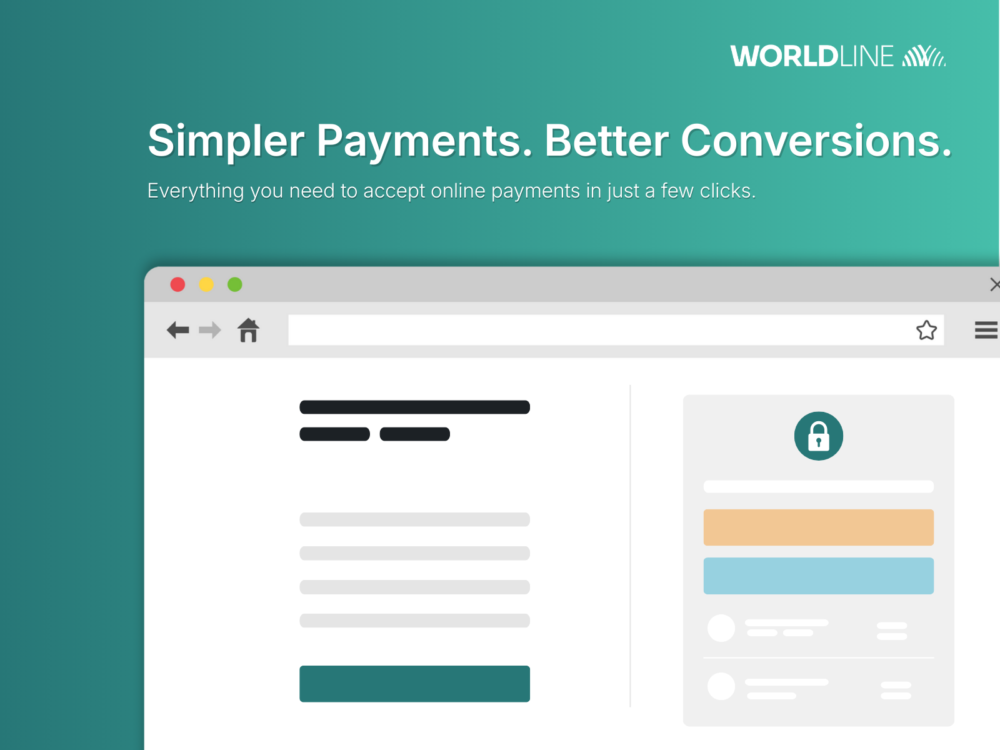
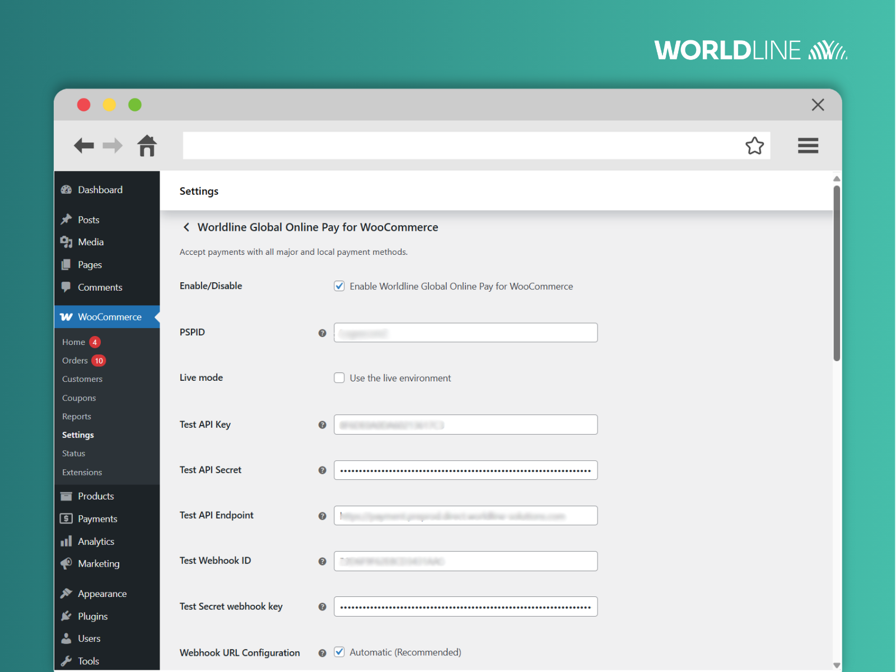

# Worldline Global Online Pay for WooCommerce

## Description

### Worldline GoPay for WooCommerce

Accept credit/debit cards, digital wallets, and over a dozen local payment methods with a fast, secure checkout that boosts conversions and builds customer trust.

* Quick and frictionless checkout experience
* Customisable checkout pages
* Support for the most popular global payment methods (Visa, MasterCard, Google Pay, Apple Pay, American Express, PayPal, Klarna, etc.)
* 15+ local payment methods supported (iDEAL, Carte Bancaire, Bizum, Bancontact, etc.)
* Authorisation and Direct Sale modes for transactions
* Cancellations, captures and refunds management
* Seamless exemption management
* PSD2 and PCI-DSS compliant
* Localised payment experience in 100+ countries
* Multistore support
* No-code setup

### Optimise your payment pages and boost conversion rates by up to 35%

Customise the design of your checkout page and give shoppers the payment options they know and trust. Activate popular local payment methods and create a more familiar checkout experience for international customers. A personalised checkout experience reduces cart abandonment rates and maximises conversion rates in every market you sell in.

### Features

#### Faster checkout

Use Worldline’s plugin to easily implement a checkout page on your store while avoiding the most common checkout errors. Let your customers either pay directly on your store with an embedded checkout page ([Hosted Tokenization Page](https://docs.direct.worldline-solutions.com/en/integration/basic-integration-methods/hosted-tokenization-page)) or get redirected to a secure Worldline page ([Hosted Checkout Page](https://docs.direct.worldline-solutions.com/en/integration/basic-integration-methods/hosted-checkout-page)) while keeping your shop PCI-compliant.

#### Customisable checkout pages

Make your checkout feel like a natural extension of your brand. This plugin offers customisable checkout templates, allowing you to match your store’s design, colours, and tone.

Whether you want a minimalist payment form or a fully branded checkout, the plugin gives you flexible options to reinforce trust and keep shoppers engaged.

#### Global payments

Let your customers pay how they want — with credit card, digital wallet, bank transfer, mealvouchers, and more. Worldline’s WooCommerce plugin supports over 25 global and local payment methods across more than 100 countries and 150 currencies.

You can enable or disable methods individually, set your preferred payment gateway titles, and fine-tune the checkout button text — all from your WooCommerce dashboard.

#### Multistore support

Selling across multiple stores or regions? This plugin is fully compatible with WooCommerce multistore setups, including multisite installations.

Each store in your network can have its own independent payment configuration, including API keys, payment methods, currencies, and checkout behaviours. This gives you complete control when managing localised stores, marketplace-style setups, or international storefronts.

### Supported Payment Methods and Currencies

Worldline’s GoPay plugin supports over 25 global and local payment methods, including:

* Credit and debit cards (Mastercard, Visa, American Express, Cartes Bancaires, etc.)
* Bank transfers
* Digital wallets (Apple Pay, Google Pay, PayPal, etc.)
* Buy now, pay later providers (e.g., Klarna)
* Local payment methods (EPS, iDEAL, Bancontact, P24, Twint, etc.)
* Mealvouchers

You can accept payments in 150+ currencies and serve customers in 100+ countries, ensuring a localised and conversion-friendly experience for every buyer — no matter where they are.

### Add Worldline payments to your WooCommerce store today

Choose the secure, reliable, and future-ready payments solution designed to support your store at every stage of growth. Install the Worldline GoPay WooCommerce plugin in just a few clicks and start accepting payments across 100+ countries immediately.

### About Worldline

Worldline is a leading global payments company with a unique mission: to turn payments from a simple necessity into a strategic advantage. As Europe’s leading payment service provider and ranked among the top worldwide, we power secure, frictionless online payment experiences.

We combine scale (over 18,000 professionals operating in 40+ countries), cutting-edge payment technology and deep industry expertise to support more than 1.4 million businesses across 170+ markets. Whether you are a small shop or a large marketplace, our solutions are designed to fit your needs — helping you grow quickly, simply, and securely.

## Screenshots

## Installation

### Requirements

To install and configure the Worldline GoPay for WooCommerce plugin, you’ll need:

* WordPress Version 6.3 (or newer) installed.
* An active WooCommerce store version 8.7 (or newer).
* PHP version 7.4 or newer.
* Worldline Merchant Account

### Installation steps

1. Log in to your WordPress Admin panel.
2. Navigate to **Plugins > Add New**.
3. Search for the “**Worldline GoPay for WooCommerce**” plugin.
4. Click on Install Now and wait until the installation finishes.
5. Click the Activate button on the success page (or activate it later in **Plugins > Installed Plugins**).

### Configuration

#### Connection

1. After activating the Worldline GoPay for WooCommerce plugin, navigate to **WooCommerce > Settings > Payments**.
2. Click “**Manage**” on Worldline GoPay for WooCommerce.
3. Fill in the PSPID, API Key, and API Secret fields (live/test depending on your environment) from your Worldline Merchant Portal (Developer > Payment API).
4. Click on “**Save changes**” to store these settings in the plugin.

#### Webhooks

1. Navigate to **Developer > Webhooks** inside Worldline Merchant Portal and click “**Generate webhook keys**”.
2. Copy the generated details into the fields “Webhook ID” and “Secret webhook key” inside the plugin.
3. Choose if you’ll use manual or automatic webhook URL configuration under “**Webhook URL Configuration**”.
    * **Automatic (Recommended)**: The URL(s) listed below will be used for transactions from this store, and any webhook URL(s) configured in the merchant portal will be ignored. You can add up to 4 additional webhook URLs in “Additional Webhook URLs”.
    * **Manual**: Copy the “Store Webhook URL” from the plugin configuration and add the webhook endpoint in the Worldline back office at Developer > Webhooks by clicking “Add Webhook Endpoint”.
4. Click on “**Save changes**” to store these settings in the plugin.

For more information on configuring the Worldline GoPay for WooCommerce plugin, check out our [official onboarding guide](https://docs.direct.worldline-solutions.com/en/integration/how-to-integrate/plugins/woocommerce).

### Updating

The Worldline GoPay for WooCommerce plugin can be updated both manually and automatically. However, we still recommend backing up your site regularly, just in case.

If you encounter any issues with the plugin or its functions after an update, purge your website cache.

If that doesn’t solve the problem, create a thread on the [support forums](https://wordpress.org/support/plugin/worldline-for-woocommerce/) or contact our support team through [this form](https://docs.direct.worldline-solutions.com/en/about/contact/).

## Changelog

### 2.5.12 - 2026-03-09
* Added: Support of payment method “Blik”
* Added: Support of payment method “Przelewy24”
* Added: Support of payment method “Linxo Connect”

### 2.5.11 - 2026-03-03 
* Improved: Offer the possibility to only accept instant bank transfer on CAWL Gateway.
  
### 2.5.10 - 2026-02-27
* Added: Deleting a consumer’s stored token from their account now also deletes the token on the payment platform

### 2.5.9 - 2026-02-24
* Updated: Branding of Pledg changed to Sofinco
* Updated: Branding of iDeal changed to iDEAL | Wero

### 2.5.8 - 2026-02-24
* Improved: Offer the possibility to only accept instant bank transfer.
* Fixed: Branding for Worldline Bank Transfer solution

### 2.5.7 - 2026-02-10
* Added: Support of payment method “SEPA Direct Debit”

### 2.5.6 - 2026-02-04
* Fix: Stability for 3DS exemption capabilities

### 2.5.5 - 2026-01-28
* Fixed issue with displaying order on legacy Order data storage
* Improved exemptions capabilities related to 3DS exemption types

### 2.5.4 - 2026-01-13
* Improved: Add subbrand for Apple Pay and Google Pay payment details
* Fix: Translation of card brands in the back-end

### 2.5.3 - 2026-01-09
* Added: Additional information about transactions in orders overview and order details.
* Improved: Apple Pay is now supported with all browsers and devices

### 2.5.2 - 2026-01-05
* Added: Possibility to auto-include primary webhooks URL in the payload of payment request, and to configure up to 4 additional endpoints.
* Added: Possibility to configure which logos will be displayed next to the “Credit cards” checkout option.
* Added: Orders that contain virtual and downloadable products will immediately go in a Completed status once the payment has been completed.
* Remove the Checkout Type field

### 2.5.1 - 2025-12-09
* Add new payment method: Pledg
* Manage exemption for FR markets

### 2.4.6 - 2025-11-17
* Fix language used for hosted checkout

### 2.4.5 - 2025-10-29
* Change surcharge settings title
* Add pending order cancellation cron job logic
* Add upload logo for hosted payment to plugin settings page
* Change author URI and contributor

### 2.4.4 - 2025-10-13
* Add missing 3DS parameters for Credit Card payments
* Fix storing the wrong API key in the database

### 2.4.3 - 2025-09-23
* Fix Apple pay issue

### 2.4.2 - 2025-09-19
* Fix plugin configuration page
* Fix translation issue
* Change plugin title to Offre e-commerce de CAWL

### 2.4.1 - 2025-09-17
* Fix fatal error issue

### 2.4.0 - 2025-08-11
* Add PayPal payment method

### 2.3.0 - 2025-07-29
* Add Mealvouchers payment method
* Add CVCO payment method
* Add EPS payment method

### 2.2.0 - 2025-04-29
* Allow SCA exemptions with Transaction Risk Analysis.
* Show totals with Surcharge on the checkout page.
* Add payment method logos on checkout.
* Improve settings tooltips.

### 2.1.0 - 2025-03-31
* Added single payment methods (Klarna, PostFinance, Twint).
* Allow to capture payments automatically after the specified time.
* Improve UI in WooCommerce 9.6+.
* Show saved cards on the Pay for Order page.
* Handle saved cards in Hosted Tokenization.
* Add payment method icons in checkout.
* Fix handling of orders that had multiple payment attempts.
* Enable 3DS by default.

### 2.0.0 - 2025-03-10
* Added Hosted Tokenization (credit cards) payment method.
* Added single payment methods (ApplePay, BankTransfer, GooglePay, iDeal).
* 3DS improvements (Frictionless Flow, Exempt Flow & Challenge Flow).
* Allow to specify templates of hosted tokenization and hosted checkout pages.
* Allow to change the payment method title.
* Allow to disable submission of the cart data.

### 1.0.1 - 2024-10-02
* Allow to set test and live webhook credentials separately.
* Improve refunding, mark refunded items.
* Fix payment method title.

### 1.0.0 - 2024-08-01
* Initial release.

## Frequently Asked Questions

### How do I start using Worldline GoPay with WooCommerce?

To start using the Worldline GoPay for WooCommerce plugin, you need to:

1. Install the plugin.
2. [Create a Worldline Merchant Account.](https://docs.direct.worldline-solutions.com/en/getting-started/)
3. Enter your API credentials into the plugin settings.
4. Enable your desired payment methods.

You are then ready to start processing payments on your WooCommerce store!

### How do I set up the Worldline GoPay for WooCommerce plugin

You can follow the steps outlined in the “Installation” tab on this page to install the plugin on your WooCommerce shop. Alternatively, you can find a more detailed installation guide on our [documentation website](https://docs.direct.worldline-solutions.com/en/integration/how-to-integrate/plugins/woocommerce).

### Do I need a Worldline merchant account to use this plugin?

Yes, you need to create a Worldline Merchant Account to use this plugin. However, you can first [request a free test account](https://signup.direct.preprod.worldline-solutions.com/) to explore the plugin’s features before committing to it.

### What are the requirements to use the plugin?

To use the Worldline GoPay for WooCommerce plugin, you need to meet the following requirements:

* You need to have an active WooCommerce store version 8.7 or newer.
* You need to update your WordPress to version 6.3 or newer.
* You need PHP version 7.4 or newer.
* You need to have an active Worldline Merchant Account to process live payments.

### Do I need to be PCI-DSS certified to use this plugin?

Yes, but you only need the lowest PCI-DSS certification (SAQ-A) when using Worldline GoPay for WooCommerce plugin.

### How can I test the Worldline GoPay for WooCommerce plugin?

You can use a [Worldline test account](https://signup.direct.preprod.worldline-solutions.com/) to simulate payments before connecting a live Merchant Account.

### Does the plugin support WooCommerce Subscriptions?

Unfortunately, no. The plugin doesn’t currently support WooCommerce subscriptions.

### How can I contact Worldline GoPay for WooCommerce plugin support?

If you need help setting up the plugin, we recommend reviewing our [official plugin documentation](https://docs.direct.worldline-solutions.com/en/integration/how-to-integrate/plugins/woocommerce). In case you need additional support, please create a new thread on the support forums or contact our support team through [this form](https://docs.direct.worldline-solutions.com/en/about/contact/).
